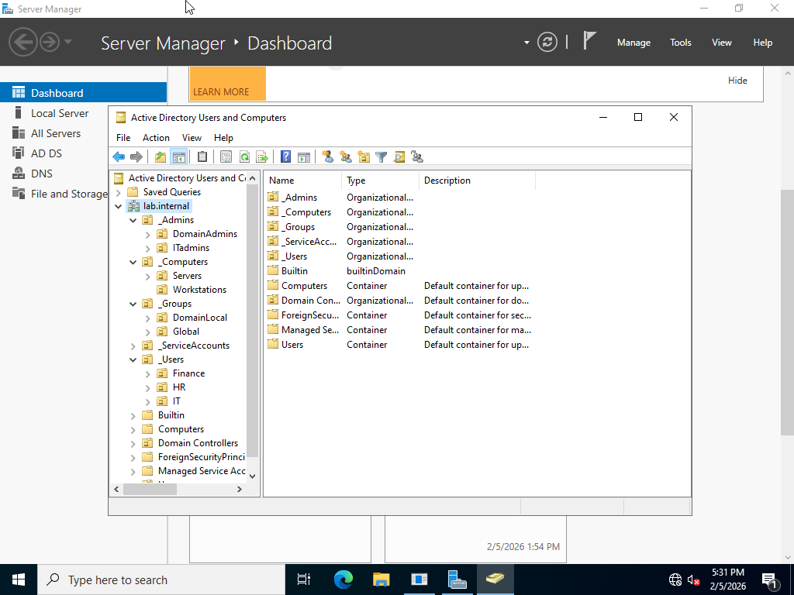

## Overview

A Windows Server virtual machine was installed to act as Domain Controller for the local network, with the purpose of centralized authentication and authorization of endpoints. The Domain Controller received the static IPv4 address:

- 192.168.1.5/24

---

## Roles

The Windows Server was configured with the AD DS role to promote the machine to a Domain Controller, and the DNS Server role to handle name resolution and act as authoritative DNS.

---

## Forest / Domain Creation

Only one domain was created within the forest due to hardware restrictions. The domain name is:

- lab.internal

---

## OU Structure

Objects were separated into specific OUs based on department and function to simplify management and GPO application.

---

## Domain Join

Both Windows 11 Pro machines required endpoint configuration to complete the domain join. The process involved changing the default DNS server from the gateway to the Domain Controller in the IPv4 settings, then joining the domain via endpoint **Settings** by entering `lab.internal` with administrator credentials.

Connectivity and successful domain join were verified using the following commands:

- `ping 192.168.1.5`  
- `nslookup lab.internal`
  
