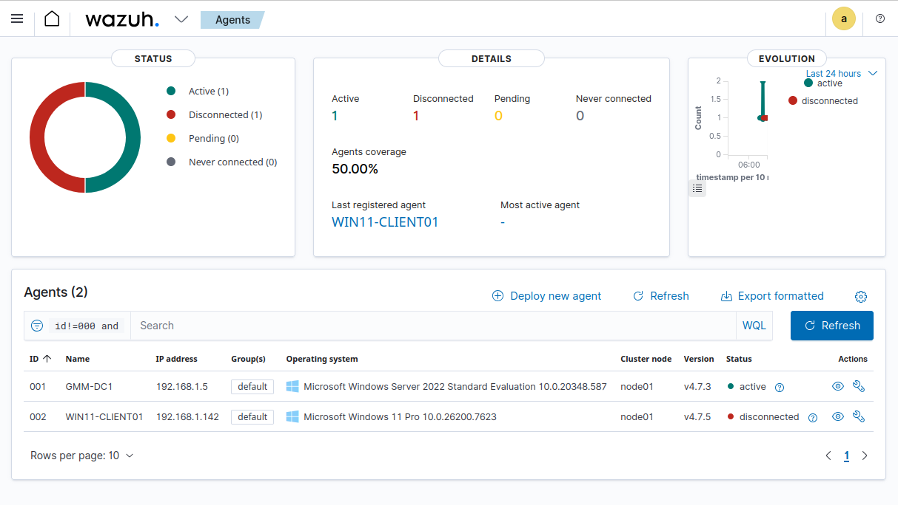

# Wazuh – EDR & SIEM

## Overview

Wazuh was deployed in this lab as a centralized security monitoring and response platform, acting as both EDR (Endpoint Detection and Response) and SIEM (Security Information and Event Management).

The solution collects endpoint telemetry, correlates events, detects suspicious behavior, and provides centralized visibility across the Active Directory environment. This allows monitoring of:

- Successful and failed logons  
- Account and group modifications  
- System events  
- Suspicious processes  
- Brute force / password spraying attempts  
- Host configuration changes  

The architecture follows the classic manager + agents model.

---

## Architecture

- Wazuh Manager: Installed on a dedicated VM  
- Wazuh Agents: Installed on Windows workstations and the Domain Controller  
- Communication over default Wazuh ports (TCP/1514 and TCP/1515)  
- Each endpoint forwards events to the Manager, which processes, correlates, and stores the data  

The Manager is responsible for:

- Receiving agent logs  
- Applying detection rules  
- Generating alerts  
- Centralizing security visibility  

Agents perform:

- Windows Event Log collection  
- File Integrity Monitoring (FIM)  
- System inventory  
- Malware / anomalous behavior detection  

---

## Agent Installation (Windows)

On each domain-joined machine:

- Download the Wazuh agent installer  
- Install via MSI  
- Configure the Manager IP in `ossec.conf`  
- Register the agent with the Manager  
- Start the Wazuh service  

After installation, the agent attempts to authenticate with the Manager:

"C:\Program Files (x86)\ossec-agent\agent-auth.exe" -m <MANAGER_IP>

Each endpoint receives a unique agent ID.

Note: duplicate agent names will cause registration failures. Each host must have a unique hostname.

---

## Active Directory Integration

Wazuh is integrated with Active Directory to monitor critical security events, including:

- Authentication attempts  
- User creation, deletion, and modification  
- Privileged group changes  
- Kerberos events  
- Interactive and remote logons  

This enables realistic Blue Team scenarios such as:

- Brute force detection  
- Password spraying  
- Account enumeration  
- Lateral movement simulation  

---

## Lab Use Cases

Wazuh is primarily used for:

### Endpoint Monitoring

- Host status  
- Running services  
- Processes  
- Software inventory  

### Attack Detection

- Repeated login failures  
- Abnormal access patterns  
- Suspicious account creation  
- Execution of uncommon binaries  

### Centralized Logging

All relevant security events are consolidated on the Manager, enabling easier correlation and analysis.

---

## Educational Purpose

The Wazuh deployment in this lab is designed to:

- Simulate a basic SOC environment  
- Practice alert analysis  
- Understand EDR/SIEM workflows in Windows infrastructures  
- Train incident response in an Active Directory context  

This setup brings the lab closer to a real corporate environment and supports Blue Team skill development, including:

- Monitoring  
- Detection engineering  
- Incident triage  
- Endpoint visibility  

---

## Known Limitations

- Small-scale environment (single DC, limited endpoints)  
- No high availability  
- Mostly default detection rules (no advanced custom rules yet)  

These limitations are intentional, prioritizing progressive learning.
